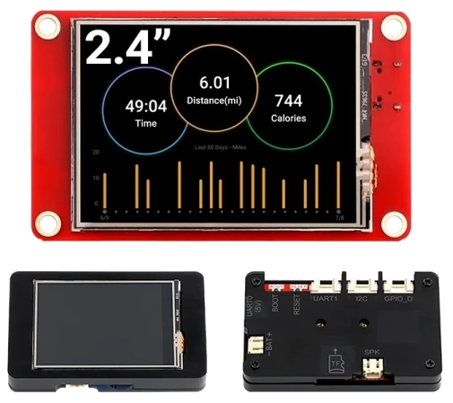

# BSP: Elecrow CrowPanel 2.4-inch

| [HW Reference](https://www.elecrow.com/wiki/esp32-display-242727-intelligent-touch-screen-wi-fi26ble-240320-hmi-display.html) | [HOW TO USE API](API.md) | [EXAMPLES](#compatible-bsp-examples) |  |  |
| --- | --- | --- | --- | -- |

> [!WARNING]
> The SD card is not working simultaneously with the LCD screen. We are working on a fix.

## Overview

<table>
<tr><td>

This BSP supports the following Elecrow CrowPanel series devices:

- CrowPanel ESP32 Display 2.4-inch

M5Stack Core is a development board based on ESP32 microcontroller. It features:

- **MCU**: ESP32 dual-core Xtensa® 32-bit LX6 microprocessor, up to 240MHz
- **Memory**: 4MB Flash + 520KB SRAM
- **Interface**: USB Type-C for programming and debugging
- **Display**: 2.4" TFT LCD screen (240x320 resolution) with ILI9341V & XPT2046 controllers
- **Audio**: Single GPIO controlled speaker
- **Storage**: microSD card slot (SPI interface)
- **Input**: Two physical buttons through GPIO_D interface (Button1, Button2)

</td><td width="200" valign="top">
  
</td></tr>
</table>

## Capabilities and dependencies

<!-- START_DEPENDENCIES -->

|     Available    |       Capability       |Controller/Codec|                                                 Component                                                |     Version    |
|------------------|------------------------|----------------|----------------------------------------------------------------------------------------------------------|----------------|
|:heavy_check_mark:|     :pager: DISPLAY    |     ili9341    |idf [espressif/esp_lcd_ili9341](https://components.espressif.com/components/espressif/esp_lcd_ili9341)|>=5.2 ^2.0.1|
|:heavy_check_mark:|:black_circle: LVGL_PORT|                |      [espressif/esp_lvgl_port](https://components.espressif.com/components/espressif/esp_lvgl_port)      |       ^2       |
|        :heavy_check_mark:       |    :point_up: TOUCH    |          xpt2046      |                 [atanisoft/esp_lcd_touch_xpt2046](https://components.espressif.com/components/atanisoft/esp_lcd_touch_xpt2046)                                                                                         |       ^1.0.6         |
|:heavy_check_mark:| :radio_button: BUTTONS |                |             [espressif/button](https://components.espressif.com/components/espressif/button)             |       ^4       |
|        :x:       |  :musical_note: AUDIO  |                |                                                                                                          |                |
|:heavy_check_mark:| :speaker: AUDIO_SPEAKER|                |                                                                                                          |                |
|        :x:       | :microphone: AUDIO_MIC |                |                                                                                                          |                |
|:heavy_check_mark:|  :floppy_disk: SDCARD  |                |                                                    idf                                                   |      >=5.2     |
|        :x:       |    :video_game: IMU    |                |                                                                                                          |                |

<!-- END_DEPENDENCIES -->

## Compatible BSP Examples

<!-- START_EXAMPLES -->

| Example | Description | Try with ESP Launchpad |
| ------- | ----------- | ---------------------- |
| [Display Example](https://github.com/espressif/esp-bsp/tree/master/examples/display) | Show an image on the screen with a simple startup animation (LVGL) | [Flash Example](https://espressif.github.io/esp-launchpad/?flashConfigURL=https://espressif.github.io/esp-bsp/config.toml&app=display-) |
| [Display Rotation Example](https://github.com/espressif/esp-bsp/tree/master/examples/display_rotation) | Rotate screen using buttons or an accelerometer (`BSP_CAPS_IMU`, if available) | [Flash Example](https://espressif.github.io/esp-launchpad/?flashConfigURL=https://espressif.github.io/esp-bsp/config.toml&app=display_rotation-) |

<!-- END_EXAMPLES -->

<!-- START_BENCHMARK -->
<!-- END_BENCHMARK -->
